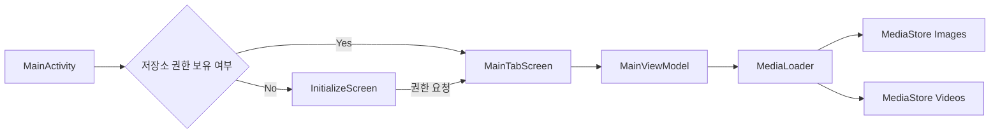

# CustomPicker

> Jetpack Compose + MediaStore 기반으로 사진, 비디오, 통합 미디어를 탐색할 수 있는 커스텀 피커 샘플 프로젝트입니다.

<div align="center">
  
  
  
  
</div>

## Preview

| 사진 | 비디오 | 사진 & 비디오 |
| --- | --- | --- |
|  |  |  |

## Overview

CustomPicker는 단말의 `MediaStore`를 직접 조회해 미디어를 보여주는 샘플 앱입니다.  
기본 갤러리 인텐트에 의존하지 않고, 앱이 원하는 방식으로 미디어 목록을 구성하고 필터링하는 구조를 확인하는 데 초점이 있습니다.

이 프로젝트에서 바로 확인할 수 있는 흐름은 아래와 같습니다.



## 핵심 기능

| 기능 | 설명 |
| --- | --- |
| 권한 분기 처리 | Android 13 이상에서는 `READ_MEDIA_IMAGES`, `READ_MEDIA_VIDEO`를, 그 이하 버전에서는 `READ_EXTERNAL_STORAGE`를 요청합니다. |
| 탭 기반 미디어 탐색 | `사진`, `비디오`, `사진&비디오` 3개 탭으로 미디어를 분리해서 탐색할 수 있습니다. |
| 디렉터리 드롭다운 필터 | 상단 드롭다운에서 앨범(버킷)을 선택해 특정 디렉터리만 빠르게 볼 수 있습니다. |
| 전체 앨범 가상 항목 제공 | 각 탭에서 `전체` 항목을 만들어 모든 디렉터리를 한 번에 탐색할 수 있습니다. |
| 통합 탭 병합 로딩 | 사진과 비디오를 각각 조회한 뒤 하나의 리스트로 병합하고, 수정일 기준으로 다시 정렬해 보여줍니다. |
| 3열 그리드 UI | 모든 탭이 동일한 3열 그리드를 사용해 일관된 탐색 경험을 제공합니다. |
| 비디오 전용 오버레이 | 비디오 아이템은 재생 아이콘과 재생 시간을 오버레이로 표시합니다. |
| 취소 가능한 비동기 로딩 | 탭이나 디렉터리가 바뀌면 이전 로딩 작업을 취소하고 최신 요청만 반영합니다. |

## 이 프로젝트의 특징

### 1. 피커 로직이 UI와 분리되어 있습니다

- 화면은 `NavigationConfiguration`, `MainTabScreen`, `CustomMediaGridList` 같은 Compose 컴포넌트로 구성됩니다.
- 데이터 조회는 `MainViewModel`과 `MediaLoader` 계층으로 분리되어 있어, UI 수정과 로딩 로직 수정의 경계를 비교적 명확하게 유지합니다.

### 2. 통합 탭 처리 방식이 단순 합치기에 그치지 않습니다

- 사진 디렉터리 목록과 비디오 디렉터리 목록을 `bucketId` 기준으로 병합합니다.
- 같은 디렉터리라면 개수를 합산하고, 대표 이름과 썸네일 경로를 유지합니다.
- 실제 미디어 목록 역시 사진과 비디오를 따로 조회한 뒤 `dateModified`, `dateAdded`, `id` 순서로 다시 정렬합니다.

### 3. 긴 목록을 고려한 로딩 흐름을 가지고 있습니다

- `emitSize` 기반 청크 로딩 구조를 두고 있어 한 번에 모든 데이터를 UI에 넘기지 않도록 확장할 수 있습니다.
- `CancellationSignal`과 코루틴 취소 상태를 함께 확인해, 이전 요청 결과가 늦게 도착해도 현재 화면 상태를 덮어쓰지 않도록 방어합니다.

### 4. 샘플 프로젝트로 보기 좋은 단순한 구조입니다

- 권한 요청
- 네비게이션 시작 화면 분기
- 탭 전환
- 앨범 필터링
- MediaStore 조회

위 흐름이 비교적 짧은 코드 경로 안에 모여 있어서, 커스텀 갤러리/피커 구현을 학습하거나 실험하기에 적합합니다.

## 화면 구성

| 화면 | 역할 |
| --- | --- |
| `InitializeScreen` | 권한이 없는 상태에서 진입하는 초기 화면입니다. |
| `MainTabScreen` | 탭과 상단 필터를 포함하는 메인 화면입니다. |
| `CustomPickerTopBar` | 현재 디렉터리 이름과 드롭다운 앨범 선택 UI를 담당합니다. |
| `CustomMediaGridList` | 실제 사진/비디오 썸네일을 3열 그리드로 렌더링합니다. |

## 기술 스택

| 영역 | 사용 기술 |
| --- | --- |
| UI | Jetpack Compose, Material 3 |
| Navigation | Navigation Compose |
| DI | Hilt |
| Async | Kotlin Coroutines, StateFlow |
| Image Loading | Glide Compose |
| Media Access | Android `MediaStore` |

## 프로젝트 구조

```text
app/src/main/java/com/example/custompicker
├── MainActivity.kt
├── MainViewModel.kt
├── UiState.kt
├── media
│   ├── MediaLoader.kt
│   └── MediaLoaderImpl.kt
├── model
│   ├── ContentQuery.kt
│   ├── ItemGalleryMedia.kt
│   └── PickerDir.kt
├── screen
│   ├── NavigationConfiguration.kt
│   ├── MediaTabScreen.kt
│   ├── inital/InitializeeScreen.kt
│   └── tab
├── topbar
│   └── CustomPickerTopBar.kt
└── di
    ├── DispatcherModule.kt
    └── MediaLoaderModule.kt
```

## 실행 방법

### Android Studio

1. 프로젝트를 Android Studio에서 엽니다.
2. Gradle Sync가 끝나면 에뮬레이터 또는 실기기를 연결합니다.
3. 앱을 실행한 뒤 저장소 권한을 허용합니다.

### Command Line

```bash
./gradlew :app:assembleDebug
```

## 이런 상황에 잘 맞습니다

- 기본 시스템 피커 대신 직접 만든 미디어 브라우저가 필요한 경우
- 사진/비디오를 다른 탭 정책으로 보여주고 싶은 경우
- 앨범(버킷) 기반 필터 UI가 필요한 경우
- Compose로 커스텀 갤러리 샘플을 빠르게 확인하고 싶은 경우

## 현재 범위

이 프로젝트는 "미디어를 잘 보여주고 분류하는 것"에 집중한 샘플입니다.  
선택 완료 액션, 멀티 선택 플로우, 크롭/편집, 업로드 연동 같은 실제 프로덕션 피커의 후속 단계는 아직 포함되어 있지 않습니다.

## 한 줄 요약

`CustomPicker`는 Compose 기반 커스텀 미디어 피커를 구현할 때 필요한 핵심 뼈대, 즉 권한 처리, MediaStore 조회, 탭 분리, 앨범 필터, 통합 정렬 로직을 간결하게 담아낸 샘플 프로젝트입니다.
